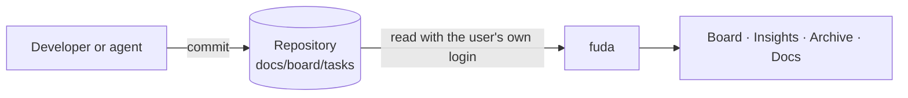

# What fuda is

fuda is a board over a git repository. Each task is a markdown file in
`docs/board/tasks/`, and its frontmatter (`status`, `owner`, `labels`, …) is its state. fuda reads
those files from GitHub, Azure DevOps or a local checkout and shows them as a board, an insights
view, an archive and a reader for the repository's docs.

People, and their AI agents, move tasks with ordinary commits. On GitHub, people can also drag a
card to another column. fuda then commits one change to the task file as the person who dragged:
the `status` line, and `claimed` set to today the first time the task leaves the first column.
Nothing else in the file changes, and fuda never force-pushes. If someone changed the task's
status first, the card goes back and a message says who moved it. Archived tasks and the
In review column cannot be dragged to or from. In the task panel, the Owner field has a picker: choose
people from `people.md` (or the names already on the board when there is no `people.md`). fuda
rewrites only the `owner` line, in the file's own style (comma text or a YAML list), adds it after
`status` when it is new, and deletes it when you remove every owner. A change to the owners that
someone else made first wins, with a message saying who set which owners. The browser asks for changes about every 5 seconds, so the board follows a push within
about 10 seconds.

## Where to go next

| You want to | Read |
|---|---|
| Put a repository on fuda | [Set up a repo](/guide/setup-a-repo) |
| Write or change tasks | [Task format](/guide/task-format) and [Workflow](/guide/workflow) |
| Control columns, label filters and people | [Board config files](/guide/board-config) |
| Let your AI agent keep the board right | [Agent guide](/guide/agent-guide) |
| Try fuda on your machine | [Run locally](/guide/run-locally) |
| Host it for a team | [Self-host](/guide/self-host) |

## How the board decides things

- **Columns** come from `docs/board/stages.md`, or from the statuses found in the tasks. A status
  that no column lists gets its own column, marked unknown, so nothing is ever hidden.
- **In review** is the one derived column: a task whose id is in the title or branch name of an
  open pull request in a repository listed in `repos.md`. Such a card is locked. When the pull
  request closes, the card goes back to its `status` column; fuda never sets `merged`.
- **In prod** appears when fuda also watches `main` and the task's file there is merged, testing
  or validated.
- **Problems** lists files fuda could not read. They are left off the board and the rest still
  works.
