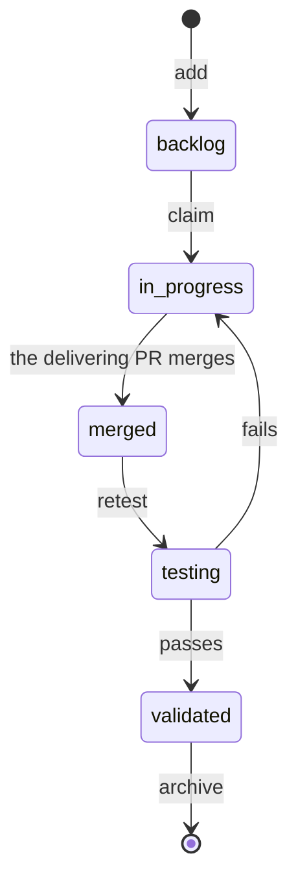

# Workflow

Copy this into your repo's `docs/board/TASKS.md`, and keep your own rules (promotion, batches,
reviews) in `WORKFLOW.md`.

| Step | Change in the task file | Where |
|---|---|---|
| Add | A new file, `status: "backlog"`, `added` = today | A small commit on `develop` |
| Claim | `owner`, `status: "in progress"`, `claimed` = today. Already owned: pick another task | A small commit on `develop`, **before** branching |
| Deliver | `status: "merged"`, the PR number in `pr`, an `## Evidence` section | **In the pull request**, in the same diff as the code. While a pull request whose title or branch names the task is open, the card shows In review |
| Retest | `status: "testing"` (and `tester`), then `"validated"`; on failure back to `"in progress"` with what failed | Small commits on `develop` |
| Blocked | Set or clear `blocked_by` | A small commit |
| Abandon | `status: "backlog"`, clear `owner` and `claimed`, the reason in `## Evidence` | A small commit |
| Archive | Move to `archive/`, `status: "done"`, `done` = the date | A small commit, once the task has been in prod for a while |



A claimed task stays where its status says until someone moves it. The status alone decides the
column.

Small commits touch only `docs/board/`. If your branch policy blocks direct pushes to `develop`,
give the people who move tasks permission to push them, or use tiny pull requests.

## CI/CD

Task commits are frequent and change no code, so skip builds when every changed file is under
`docs/board/`:

```yaml
# GitHub Actions
on:
  push:
    branches: [develop, main]
    paths-ignore: ['docs/board/**']
  pull_request:
    paths-ignore: ['docs/board/**']
```

```yaml
# Azure Pipelines
trigger:
  branches: { include: [develop, main] }
  paths:
    exclude: [docs/board/*]
```

On Azure DevOps, give the develop build-validation policy the same path filter
(`!/docs/board/*`), or board-only pull requests will wait for a build.
